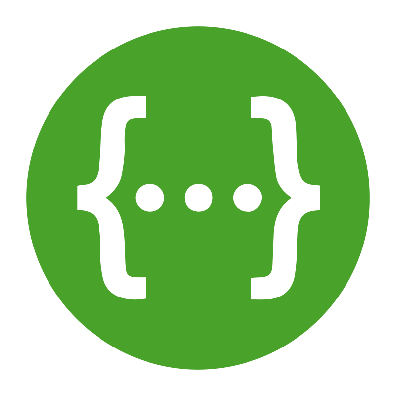
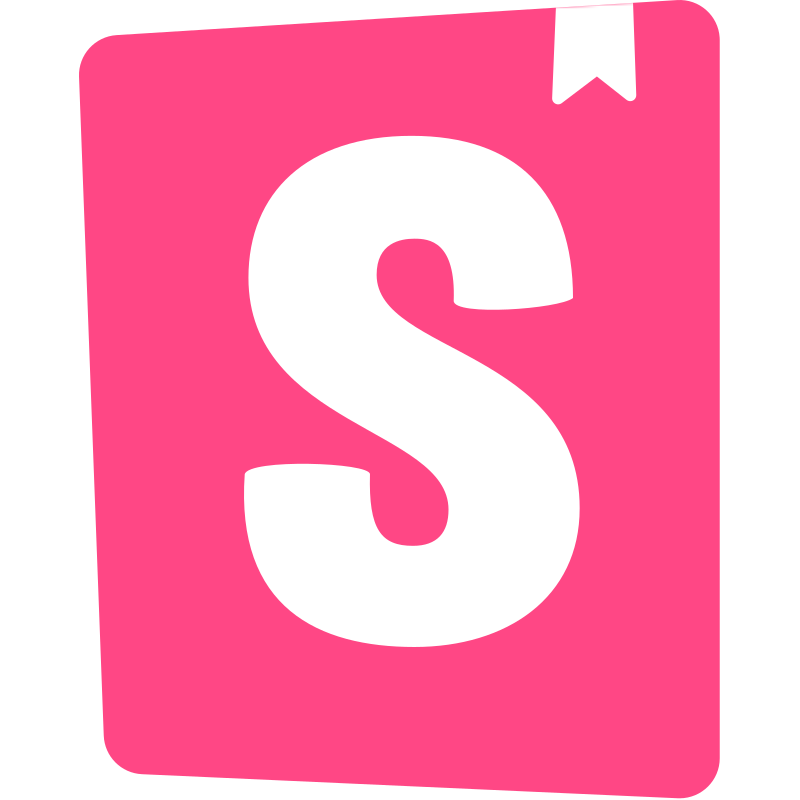
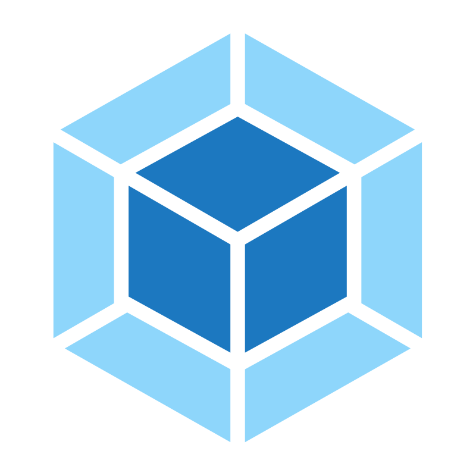

## Hi there 👋

 

3.5+ years of experience in building scalable web (React/Next) and mobile (React Native/Expo) applications. Currently focused on high-performance backend architecture with Node.js (Express/Fastify). Helping businesses grow by building high-quality software.

 

### 🚀 My stack

<table>
  <tr>
    <td align="center" width="126"> JavaScript</td>
    <td align="center" width="126"> TypeScript</td>
    <td align="center" width="126"> Next.js</td>
    <td align="center" width="126"> React</td>
    <td align="center" width="126"> React Native</td>
    <td align="center" width="126"> Redux / RTK</td>
    <td align="center" width="126"> Zustand</td>
    <td align="center" width="126"> TanStack</td>
  </tr>
  <tr>
    <td align="center" width="126"> Node.js</td>
    <td align="center" width="126"> Express</td>
    <td align="center" width="126"> Fastify</td>
    <td align="center" width="126"> PostgreSQL</td>
    <td align="center" width="126"> Mongo DB</td>
    <td align="center" width="126"> Prisma</td>
    <td align="center" width="126"> Redis</td>
    <td align="center" width="126"> Swagger</td>
  </tr>
  <tr>
    <td align="center" width="126"> Storybook</td>
    <td align="center" width="126"> Webpack</td>
    <td align="center" width="126"> Vite</td>
    <td align="center" width="126"> Turborepo</td>
  </tr>
</table>
